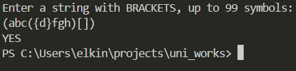
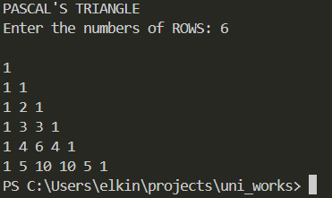
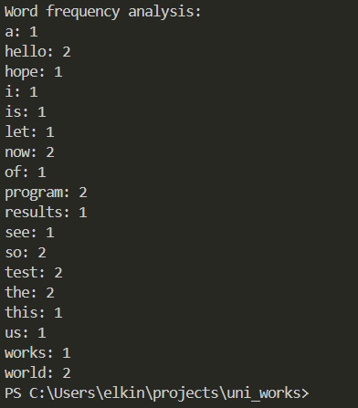
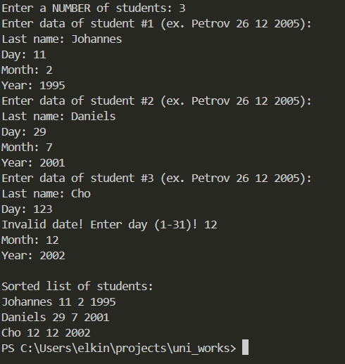

# Программирование - Язык С. Сдача автоматом

### Задача 1
#### Постановка задачи:
Проверка сбалансированности скобок в выражении. Напишите программу для проверки корректности расстановки круглых, фигурных и квадратных скобок в заданной строке.
- Вход. Строка с выражением, содержащим скобки (может включать и другие символы).
- Выход. Вывести `YES`, если все типы скобок в строке корректно сбалансированы, или `NO` – если допущена ошибка в порядке скобок.
- Требования. Для проверки использовать стек. Алгоритм должен учитывать соответствие типов скобок (например, `[` соответствует `]`) и их порядок вложенности. Программа игнорирует несвязанные символы и анализирует только скобки. При обнаружении несбалансированной скобочной структуры обработать ситуацию и вывести `NO`. Использование стека должно быть реализовано вручную (например, через массив или связный список), без использования сторонних коллекций

#### Список идентификаторов:

| Имя        | Тип           | Описание                                      |
| ---------- | ------------- | --------------------------------------------- |
| string     | `const char*` | Входная строка для проверки, параметр функции |
| stack      | `char[]`      | Стек для хранения открывающих скобок          |
| top        | `int`         | Индекс вершины стека                          |
| i          | `int`         | Индекс текущего символа в строке              |
| current    | `char`        | Текущий обрабатываемый символ                 |
| opening    | `char`        | Открывающая скобка, извлеченная из стека      |
| userString | `char[]`      | Буфер для хранения ввода пользователя         |
#### Код программы:
```c
#include <string.h>
#include <stdio.h>

#define MAX_SIZE 100

// функция для проверки скобок
void bracketsCheck(const char *string)
{
    char stack[MAX_SIZE]; // реализация стека в массиве
    int top = -1; // top указывает на вершину стека
    //-1 - когда пуст, >= 0 - когда содержит элементы

    for(int i = 0; string[i] != '\0'; i++)
    {
        char current = string[i]; 
        if(current == '(' || current == '{' || current == '[')
        {
            if (top == MAX_SIZE - 1)
            {
                printf("NO\n");
                return; // стек переполнен
            }
            stack[++top] = current; // добавление открывающей скобки в стек
        }

        else if (current == ')' || current == '}' || current == ']') 
        {
            if (top == -1) 
            {
                printf("NO\n");
                return; // стек пустой, значит скобка без пары
            }

            // проверка соответствия открывающей и закрывающей скобок
            char opening = stack[top--]; 
            // получение последней открывающей скобку из стека
            if ((opening == '(' && current != ')') ||
                (opening == '{' && current != '}') || 
                (opening == '[' && current != ']')) 
            {
                printf("NO\n");
                return; // несоответствие скобок
            }
        }
    }

    // если стек пуст, значит, все скобки сбалансированы
    if (top == -1) 
        printf("YES\n");
    else
        printf("NO\n"); // остались незакрытые открывающие скобки
}

int main()
{
    char userString[MAX_SIZE];
    printf("Enter a string with BRACKETS, up to 99 symbols:\n");
    fgets(userString, MAX_SIZE, stdin);

    bracketsCheck(userString);

    return 0;
}

```
#### Результаты работы программы:


### Задача 3
#### Постановка задачи:
Генерация треугольника Паскаля. Напишите программу, которая выводит первые N строк треугольника Паскаля.
- Вход. Целое число N – количество требуемых строк треугольника Паскаля.
- Выход. N строк, каждая из которых содержит соответствующие коэффициенты треугольника Паскаля, разделённые пробелами.
- Требования. Для хранения каждой строки треугольника динамически выделять массив соответствующего размера. Не использовать фиксированные размерности массивов, расчёт должен работать для любого N разумного размера. После генерации всех строк освободить всю выделенную память (не допускать утечки памяти).

#### Математическая модель:
$$C(n,k)=C(n,k-1) \cdot \frac{n-k+1}{k}$$
#### Список идентификаторов:
| Имя        | Тип данных        | Описание                                                              |
| ---------- | ----------------- | --------------------------------------------------------------------- |
| N          | `int`             | Параметр функции `pascalTriangle`, число строк вводимое пользователем |
| row        | `int`             | Номер текущей строки                                                  |
| currentRow | `unsigned long *` | Указатель на динамически выделенную память для текущей строки         |
| i          | `int`             | Параметр циклов                                                       |

#### Код программы:
```c
#include <stdio.h>
#include <stdlib.h>

// функция для генерации и вывода треугольника Паскаля
void pascalTriangle(int N) 
{
    for (int row = 0; row < N; row++) 
    {
        // выделение памяти для текущей строки размера (row + 1)
        unsigned long *currentRow = 
        (unsigned long *)malloc((row + 1) * sizeof(unsigned long));
        
        if (currentRow == NULL) 
        {
            printf("Memory allocation ERROR!");
            return;
        }

        // первый и последний элементы строки всегда равны 1
        currentRow[0] = 1;
        currentRow[row] = 1;

        for (int i = 1; i < row; i++)
            // вычисление i-го элемента строки через рекуррентное соотношение
            currentRow[i] = currentRow[i - 1] * (row - i + 1) / i;        

        // вывод строки
        for (int i = 0; i <= row; i++)
            printf("%lu ", currentRow[i]);
        printf("\n");

        free(currentRow);
    }
}

int main() 
{
    int N;
    printf("PASCAL'S TRIANGLE\n");
    printf("Enter the numbers of ROWS: ");
    scanf("%d", &N);
    printf("\n");

    pascalTriangle(N);

    return 0;
}

```

#### Результаты выполненной работы:


### Задача 7
#### Постановка задачи:
Частотный анализ слов в файле. Напишите программу для подсчёта частоты появления каждого уникального слова в текстовом файле.
- Вход. Имя входного текстового файла передаётся в качестве аргумента. Файл содержит произвольный текст.
- Выход. Список всех уникальных слов, встретившихся в файле, и количество их вхождений, по одному на строке, в формате `<слово>: <число>`. Слова вывести в алфавитном порядке (регистронезависимо).
- Требования. Считать весь текст из файла и выполнить разделение на слова. Словом считается последовательность букв русского или латинского алфавита (другие символы – разделители). При анализе игнорировать регистр (например, слова “Пример” и “пример” считать одним словом “пример”). Для хранения множества слов и их счётчиков использовать динамические структуры данных (например, сначала сохранять встреченные слова в динамически расширяемом массиве структур вида `{слово, счетчик}`, добавляя новые элементы по мере нахождения новых слов). Можно также использовать для хранения связный список – выбор структуры остается за разработчиком, но нельзя ограничиваться фиксированным размером массива. По окончании подсчёта осуществить сортировку списка слов в алфавитном порядке (при сортировке следует сравнивать слова в одном регистре, например, все в нижнем). Вывести полученные пары слово-частота. Освободить выделенную память (для слов и структур) по завершении работы программы.

#### Список идентификаторов:
| Имя       | Тип данных      | Описание                                                        |
| --------- | --------------- | --------------------------------------------------------------- |
| Token     | `struct`        | Структура для хранения слова и счётчика вхождений               |
| word      | `char[100]`     | Поле структуры Token, слово                                     |
| count     | `int`           | Поле структуры Token, счётчик вхождений слова                   |
| fp        | `FILE *`        | Указатель на файловый поток для чтения данных                   |
| capacity  | `int`           | Текущая ёмкость динамического массива структур Token            |
| number    | `int`           | Фактическое количество элементов в массиве words                |
| words     | `Token *`       | Указатель на динамический массив структур Token                 |
| buffer    | `char[100]`     | Буфер для сборки слова из входного потока                       |
| buf_index | `int`           | Текущая позиция записи в буфере buffer                          |
| c         | `int`           | Текущий обрабатываемый символ из файла                          |
| found     | `int`           | Флаг/индекс найденного слова в массиве                          |
| i         | `int`           | Параметр циклов                                                 |
| a         | `const void *`  | Указатель типа void                                             |
| b         | `const void *`  | Указатель типа void                                             |
| w1        | `const Token *` | Приведенный указатель на первый элемент сравнения в компараторе |
| w2        | `const Token *` | Приведенный указатель на второй элемент сравнения в компараторе |
#### Код программы:
```c
#include <stdio.h>
#include <stdlib.h>
#include <string.h>
#include <ctype.h>
  
typedef struct {
    char word[100];
    int count;
} Token;
  
// функция-компаратор для qsort
int compareWords(const void *a, const void *b)
{
    const Token *w1 = (const Token *)a;
    const Token *w2 = (const Token *)b;
  
    return strcmp(w1->word, w2->word);
}
  
int main()
{
    FILE *fp = fopen("C:\\ProjectsC\\myfile.txt", "r");
    if(fp == NULL)
    {
        printf("FAILED to open the file!\n");
        exit(1);
    }
  
    int capacity = 10; // начальная ёмкость массива
    int number = 0; // текущее количество элементов в массиве
    // если number > capacity, то увеличиваем capacity
  
    Token *words = (Token *)malloc(capacity * sizeof(Token));
    if(words == NULL)
    {
        printf("Memory allocation ERROR!");
        return 1;
    }
  
    char buffer[100]; // буфер для сборки слова
    int buf_index = 0; // индекс текущей позиции в буфере
  
    int c; // считываемый из файла символ
    while((c = fgetc(fp)) != EOF)
    {
        c = tolower(c);
        if(isalpha(c))
        {
            buffer[buf_index++] = c; 
            // запись символа в буфер и переход к следующей позиции
        }
        else // символ не ялвляется буквой
        {
            // если буфер не пустой - завершаем слово
            if(buf_index > 0)
            {
                buffer[buf_index] = '\0';
                buf_index = 0;
  
                int found = -1; // индикатор нахождения текущего слова
                // при -1 слово не найдено, иначе - индекс слова в массиве структур
  
                for (int i = 0; i < number; i++) 
                // поиск полученного слова среди имеющихся
                {
                    if (strcmp(words[i].word, buffer) == 0)
                    {
                    found = i;
                    break;
                    }
                }
  
                if (found != -1) // значит слово уже было записано
                {
                    words[found].count++; // увеличиваем счётчик
                }
                else // слово не встречалось ранее, поэтому будет записано в массив
                {
                    if (number >= capacity)
                    {
                        capacity *= 2;
                        words = (Token *)realloc(words, capacity * sizeof(Token));
                        if (!words)
                        {
                            printf("Dynamic memory size change ERROR!\n");
                            fclose(fp);
                            return 1;
                        }
                    }
  
                    // слово из буфера копируется в пустой элемент массива структур
                    strcpy(words[number].word, buffer); 
                    // number в качестве индекса
                    words[number].count = 1; // так как первая встреча этого слова
                    number++;
                }
            }
        }
    }
  
    // файл закончился (EOF), но записанное слово не было прервано
    // поэтому остается его обработать
    if(buf_index > 0)
    {
        buffer[buf_index] = '\0';
  
        int found = -1;
  
        for (int i = 0; i < number; i++)
        {
            if (strcmp(words[i].word, buffer) == 0)
            {
                found = i;
                break;
            }
        }
  
        if (found != -1)
        {
            words[found].count++;
        }
        else
        {
            if (number >= capacity)
            {
                capacity *= 2;
                words = (Token *)realloc(words, capacity * sizeof(Token));
                if (!words)
                {
                    printf("Dynamic memory size change ERROR!\n");
                    fclose(fp);
                    return 1;
                }
            }
  
            strcpy(words[number].word, buffer);
            words[number].count = 1;
            number++;
        }
    }
    fclose(fp);
    qsort(words, number, sizeof(Token), compareWords);
    printf("Word frequency analysis:\n");
    for (int i = 0; i < number; i++)
    {
        printf("%s: %d\n", words[i].word, words[i].count);
    }
  
    free(words);
  
    return 0;
}
```

#### Результаты работы программы:


### Задача 12
#### Постановка задачи:
Сортировка записей студентов по дате рождения. Напишите программу для сортировки списка студентов по возрастанию даты рождения.
- Вход. Сначала задаётся целое число N – количество студентов. Далее следует N строк, каждая из которых содержит данные одного студента: фамилия (одно слово без пробелов), день, месяц и год рождения (целые числа). Пример строки: `Иванов 5 10 2000`.
- Выход. N строк с данными студентов, упорядоченными по дате рождения от самой ранней (самый возрастной студент) к самой поздней (самый молодой). Формат каждой строки вывода тот же, что во входных данных: фамилия день месяц год.
- Требования. Для хранения данных о студенте использовать структуру `Student` с полями-фамилией (строка) и вложенной структурой `Date` (с полями день, месяц, год). Считать входные данные в динамически выделенный массив структур `Student` размером N. Реализовать функцию сравнения двух дат, чтобы определить порядок сортировки. Допускается использовать стандартную функцию сортировки `qsort` (с собственной функцией-компаратор для структур `Student`) либо написать алгоритм сортировки вручную. Главное – корректно выполнить сортировку по трем значениям (год, месяц, день). При выводе данных сохранить исходный формат. После завершения работы освободить память, выделенную под массив студентов. Учесть граничные случаи: `N = 0` (нет студентов, можно сразу завершить работу программы), совпадение дат рождения (при совпадении дат двух студентов их относительный порядок может остаться как во входных данных, либо можно дополнительно сортировать по фамилии для детерминированности – на ваше усмотрение).

#### Список идентификаторов:
| Имя      | Тип данных        | Описание                                                        |
| -------- | ----------------- | --------------------------------------------------------------- |
| Date     | `struct`          | Структура для хранения даты                                     |
| d        | `int`             | Поле структуры Date: день рождения                              |
| m        | `int`             | Поле структуры Date: месяц рождения                             |
| y        | `int`             | Поле структуры Date: год рождения                               |
| Student  | `struct`          | Структура для хранения данных студента                          |
| lastName | `char[20]`        | Поле структуры Student: фамилия студента                        |
| birth    | `Date`            | Поле структуры Student: дата рождения                           |
| N        | `int`             | Количество студентов для обработки, вводится пользователем      |
| students | `Student *`       | Указатель на динамический массив структур Student               |
| i        | `int`             | Параметр циклов                                                 |
| a        | `const void *`    | Указатель типа void                                             |
| b        | `const void *`    | Указатель типа void                                             |
| student1 | `const Student *` | Приведенный указатель на первый элемент сравнения в компараторе |
| student2 | `const Student *` | Приведенный указатель на второй элемент сравнения в компараторе |

#### Код программы:
```c
#include <stdio.h>
#include <stdlib.h>
#include <string.h>
  
typedef struct {
    int d;
    int m;
    int y;
} Date;
  
typedef struct {
    char lastName[20];
    Date birth;
} Student;
  
// функция-компаратор для функции qsort
// возвращает число 
// отрицательное при a < b, ноль при a == b, положительное при a > b
int compareDate(const void *a, const void *b)
{
    // приведение указатель к типу структуры Student
    const Student *student1 = (const Student *)a;
    const Student *student2 = (const Student *)b;
  
    if(student1->birth.y != student2->birth.y)
        return student1->birth.y - student2->birth.y;
    if(student1->birth.m != student2->birth.m)
        return student1->birth.m - student2->birth.m;
  
    return student1->birth.d - student2->birth.d;
}
  
int main()
{
    int N;
    printf("Enter a NUMBER of students: ");
    scanf("%d", &N);
    getchar(); // очистка буфера ввода от символа новой строки
  
    if(N == 0)
    {
        printf("No students!");
        return 0;
    }
  
    Student *students = (Student *)malloc(N * sizeof(Student));
    if(students == NULL)
    {
        printf("Memory allocation ERROR!");
        return 1;
    }
  
    for(int i = 0; i < N; i++)
    {
        printf("Enter data of student #%d (ex. Petrov 26 12 2005):\n", i+1);
  
        printf("Last name: ");
        fgets(students[i].lastName, 20, stdin);
        students[i].lastName[strcspn(students[i].lastName, "\n")] = '\0'; 
        // удаление символа новой строки
  
        printf("Day: ");
        // проверка на корректность вводимой даты
        while(scanf("%d", &students[i].birth.d) != 1 ||
                students[i].birth.d < 1 || students[i].birth.d > 31)
        {
            printf("Invalid date! Enter day (1-31)! ");
            while(getchar() != '\n'); 
            // полная очистка буфера после некорректных данных
        }
        printf("Month: ");
        while(scanf("%d", &students[i].birth.m) != 1 ||
                students[i].birth.m < 1 || students[i].birth.m > 12)
        {
            printf("Invalid date! Enter month (1-12)! ");
            while(getchar() != '\n');
        }
  
        printf("Year: ");
        while(scanf("%d", &students[i].birth.y) != 1 ||
                students[i].birth.y < 1970 || students[i].birth.y > 2020)
        {
            printf("Invalid date! Enter year (1970-2020)! ");
            while(getchar() != '\n');
        }
  
        while(getchar() != '\n');
    }
  
    qsort(students, N, sizeof(Student), compareDate); 
    // сортировка массива студентов
  
    printf("\nSorted list of students:\n");
    for (int i = 0; i < N; i++)
        printf("%s %d %d %d\n", students[i].lastName,
                students[i].birth.d, students[i].birth.m, students[i].birth.y);
  
    free(students);
  
    return 0;
}
```

#### Результаты работы программы:



***
# Информация о студенте
Елькин Артемий, 1 курс, группа ИВТ-1.2