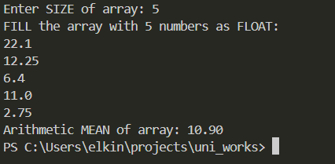
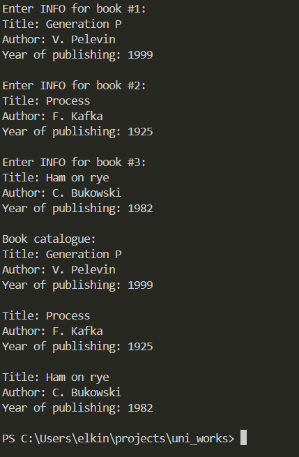
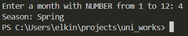

# Самостоятельная работа
### Задача 1. Динамический массив и вычисление среднего арифметического
#### Постановка задачи:
Написать программу на языке Си, которая:
- Запрашивает у пользователя количество элементов массива (целое число N).
- Динамически выделяет память для массива из N элементов типа `float`.
- Заполняет массив значениями, введёнными с клавиатуры.
- Вычисляет и выводит среднее арифметическое всех элементов массива.
- При обращении к элементам массива используйте арифметику указателей (без оператора `[]`).
- Освобождает выделенную память в конце работы программы.

#### Математическая модель:
Среднее арифметическое элементов массива равно сумме всех элементов, разделенных на размер массива.

#### Список идентификаторов:

| Имя переменной | Тип данных | Описание                                    |
| -------------- | ---------- | ------------------------------------------- |
| N              | int        | Вводимое число, размер массива              |
| arr            | float      | Указатель на массив                         |
| ptr            | float      | Указатель для работы с массивом поэлементно |
| sum            | float      | Сумма элементов массива                     |
| average        | float      | Среднее арифметическое элементов массива    |
| i              | int        | Счетчик                                     |

#### Код программы:
```c
#include <stdio.h>
#include <stdlib.h>

int main()
{
    int N;
    float *arr, *ptr, sum, average;

    printf("Enter SIZE of array: ");
    scanf("%d", &N);

    arr = (float*)malloc(N * sizeof(float));

    if (arr == NULL)
    {
        printf("Memory allocation ERROR!\n");
        return 1;
    }

    printf("FILL the array with %d numbers as FLOAT:\n", N);
    ptr = arr;

    for (int i = 0; i < N; i++)
    {
        scanf("%f", ptr);
        ptr++;
    }

    ptr = arr;

    for (int i = 0; i < N; i++)
    {
        sum += *ptr;
        ptr++;
    }

    average = sum / N;
    printf("Arithmetic MEAN of array: %.2f\n", average);

    free(arr);

    return 0;
}
```

#### Результаты работы программы:


### Задача 2. Каталог книг
#### Постановка задачи:
Создайте структуру `Book`, которая содержит следующие поля:
- `title` — массив символов (строка) для хранения названия книги (максимум 50 символов);
- `author` — массив символов для хранения имени автора (максимум 50 символов);
- `year` — целое число, обозначающее год издания книги.
Напишите программу, которая:
- Создает массив из 3-х экземпляров структуры `Book`.
- Запрашивает у пользователя данные для каждой книги (название, автора и год издания).
- Выводит информацию обо всех книгах на экран, используя для этого отдельную функцию `printBook()`, которая принимает указатель на структуру `Book`.

#### Список идентификаторов:

| Идентификатор | Тип данных | Описание                               |
| ------------- | ---------- | -------------------------------------- |
| Book          | struct     | Структура для хранения данных о книге  |
| title         | char       | Название книги                         |
| author        | char       | Автор книги                            |
| year          | int        | Год издания книги                      |
| printBook     | void       | Функция вывода данных о книге на экран |
| buffer        | char       | Буфер для очистки ввода                |
| i             | int        | Счетчик для цикла                      |

#### Код программы:
```c
#include <stdio.h>
#include <string.h>
  
#define MAX_LENGTH 30
#define NUM_BOOKS 3
  
typedef struct
{
    char title[MAX_LENGTH];
    char author[MAX_LENGTH];
    int year;
} Book;
  
void printBook(const Book *book)
{
    printf("Title: %s\n", book->title);
    printf("Author: %s\n", book->author);
    printf("Year of publishing: %d\n\n", book->year);
}
  
int main()
{
    Book books[NUM_BOOKS];
    char buffer[100];
  
    for (int i = 0; i < NUM_BOOKS; i++)
    {
        printf("Enter INFO for book #%d:\n", i + 1);
  
        printf("Title: ");
        fgets(books[i].title, MAX_LENGTH, stdin);
        books[i].title[strcspn(books[i].title, "\n")] = '\0';
  
        printf("Author: ");
        fgets(books[i].author, MAX_LENGTH, stdin);
        books[i].author[strcspn(books[i].author, "\n")] = '\0';
  
        printf("Year of publishing: ");
        scanf("%d", &books[i].year);
        fgets(buffer, sizeof(buffer), stdin);
  
        printf("\n");
    }
  
    printf("Book catalogue:\n");

    for (int i = 0; i < NUM_BOOKS; i++)
        printBook(&books[i]);
  
    return 0;
}
```

#### Результаты работы программы:


### Задача 3. Определение сезона по номеру месяца
#### Постановка задачи:
Создайте перечисление Season со следующими значениями:
- WINTER, SPRING, SUMMER, AUTUMN
Напишите программу, которая:
- Запрашивает у пользователя номер месяца (целое число от 1 до 12).
- На основе введённого номера месяца определяет и выводит соответствующий сезон:
	Зима: декабрь (12), январь (1) и февраль (2);
	Весна: март (3), апрель (4) и май (5);
	Лето: июнь (6), июль (7) и август (8);
	Осень: сентябрь (9), октябрь (10) и ноябрь (11).
- Для определения сезона можно использовать условные операторы `(if-else)` или конструкцию `switch`.

#### Список идентификаторов:
| Идентификатор | Тип данных    | Описание                |
| ------------- | ------------- | ----------------------- |
| Season        | enum          | Перечисление сезонов    |
| month         | int           | Номер месяца            |
| season        | Season        | Текущий сезон           |
| season_names  | const char*[] | Массив названий сезонов |

#### Код программы:
```c
#include <stdio.h>

enum Season
{
    WINTER,
    SPRING,
    SUMMER,
    AUTUMN
};

int main()
{
    int month;
    enum Season season;
    const char *season_names[] = {"Winter", "Spring", "Summer", "Autumn"};
  
    do
    {
        printf("Enter a month with NUMBER from 1 to 12: ");
        scanf("%d", &month);

        if (month < 1 || month > 12)
            printf("ERROR! No such month.\n");
  
    }
    while (month < 1 || month > 12);
  
    switch (month)
    {
        case 12:
        case 1:
        case 2:
            season = WINTER;
            break;
        case 3:
        case 4:
        case 5:
            season = SPRING;
            break;
        case 6:
        case 7:
        case 8:
            season = SUMMER;
            break;
        case 9:
        case 10:
        case 11:
            season = AUTUMN;
            break;
    }
  
    printf("Season: %s\n", season_names[season]);
  
    return 0;
}
```

#### Результаты работы программы:


***
# Информация о студенте
Елькин Артемий, 1 курс, группа ИВТ-1.2
